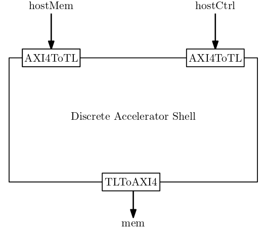
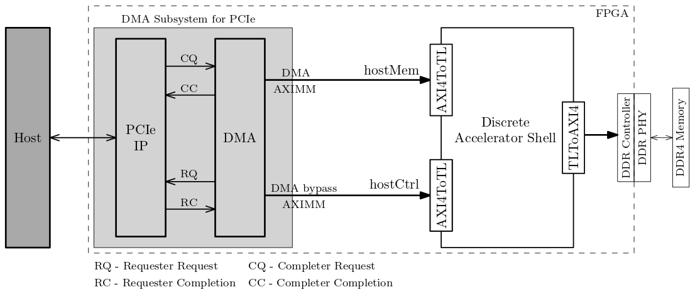
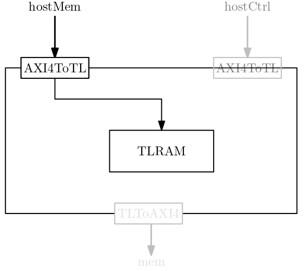
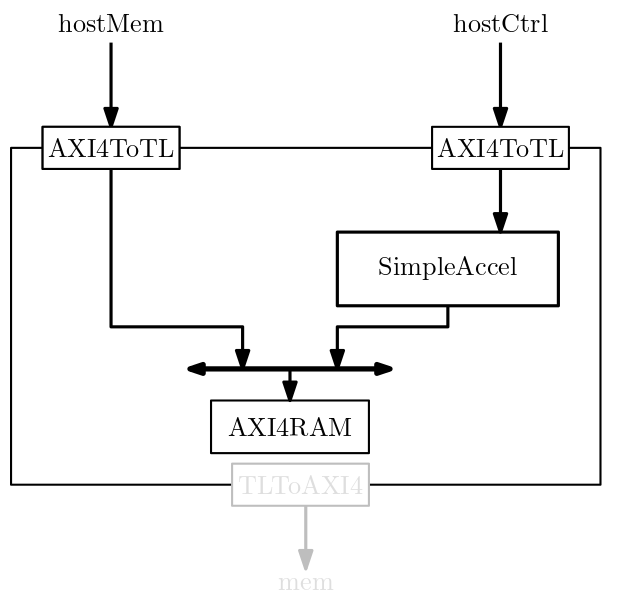

Discrete Accelerator Shell
=======================

An accelerator wrapper exposes TL-UH interfaces as AXI4 interfaces using the Diplomacy framework.


## Discrete Accelerator Interfaces 


## FPGA System Setup 


## Example modules

### Device memory Simulation environment 


### Simulation environment for a simple accelerator


As a standalone project, it uses [playground](https://github.com/morphingmachines/playground.git) as a library. `playground` and `accelShell` directories should be at the same level, as shown below.  
```
  workspace
  |-- playground
  |-- accelShell
```
Make sure that you have a working [playground](https://github.com/morphingmachines/playground.git) project before proceeding further. And do not rename/modify `playground` directory structure.

## Clone the code
```sh
$ git clone https://github.com/morphingmachines/accelShell.git
```
### Generating RTL
```sh
$ cd accelShell
$ make rtl TARGET=SimMem # other targets {SimMem, SimAccel, RRM}            
```
The output verilog files are generated in the `./generated_sv_dir` directory. This also generates a `graphml` file that visualizes the diplomacy graph of different components in the system. To view `graphml` file, as shown below, use [yEd](https://askubuntu.com/a/504178).

## Simulation
To run simulations, you need to install the following [dependencies](./doc/dependencies.md)

We use [Switchboard](https://github.com/zeroasiccorp/switchboard) to provide stimulus to the accelerator module. All the stimulus generation sources are in `./sb_sim` directory. Refer to `./sb_sim/SimDeviceMem` for more details.

After generating the RTL, follow the below steps to run the simulation.
```sh
$ cd sb_sim/SimDeviceMem
$ make 
```
